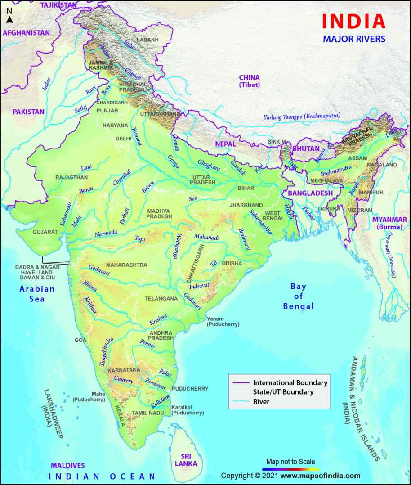
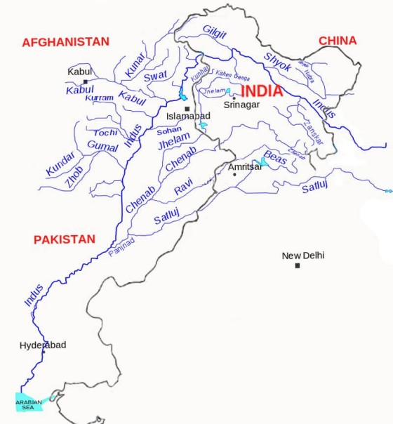
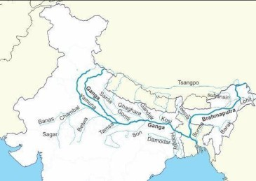

# Rivers and Lakes of India - Short Notes

1. **Drainage Systems (Introduction)**

   - Definition: Flow of water through channels → network = Drainage System.
   - Influencing Factors: Rock hardness (hard → less erosion), slope (gentle → meandering; steep → straight), water quantity (more → wider channels), tributary pattern.

2. **Drainage Patterns**

   - Dendritic: Tree-like (Ganga system).
   - Rectangular/Trellis: Right-angle joins (hard rocks).
   - Radial: Outward from hill (Amarkantak – Narmada, Son, Johila).
   - Parallel: Parallel tributaries.
   - Centripetal: Inward to lake (Aral Sea example).
   - Centrifugal (Radial Outward): Opposite of centripetal.
   - Barbed: Tributaries join opposite to main flow direction.

3. **Classification (Origin/Location)**
   - Himalayan Rivers: Perennial (snow + rain-fed).
   - Peninsular Rivers: Seasonal (rain-fed; check dams/reservoirs).

4. **Major Rivers of India**

5. **Indus River System**

   - Also known as: Sindhu (India named after this - Hindustan).
   - Origin: Bokhar Chu Glacier, near Lake Mansarovar, Kailash Range, Tibet.
   - Also called: Senge Khabab (Lion's Mouth).
   - Total Length: 2,897 km.
   - Entry into India: Dhamchok (between Ladakh and Zaskar Range).
   - Countries: Trans-boundary - China, India, Pakistan.
   - Outflow: Arabian Sea near Karachi.
   - Entry into Pakistan: Skardu region (Gilgit-Baltistan).
   - Special Feature: Hairpin bend near Nanga Parbat.
   - Panchnad (Five Rivers Meeting Point): Mithankot, Pakistan; Rivers joining Indus: Jhelum, Chenab, Ravi, Beas, Sutlej.

6. **Tributaries of Indus**
   - Left Bank: Zanskar (Origin: Greater Himalaya; Joins: Indus).
   - Right Bank:
     - Shyok (Origin: Rimo Glacier, Aksai Chin; Joins: Indus).
     - Nubra (Tributary of Shyok; Drainage Pattern: Barbed - joins opposite to main flow; Question: Tributary joins opposite to flow → barbed drainage).
     - Gilgit (Origin: Near Afghanistan, Durand Line; Joins: Indus).
   - Important Punjab Rivers (Panchnad):
     - Jhelum: Origin: Verinag Spring, Kashmir; Also known: Hydaspes (Greek); Lakes: Dal & Wular (fed by Jhelum); Cultivation: Water chestnut (singhara); Joins: Chenab near Jhang; Historical: Battle of Hydaspes (Alexander vs Porus).
     - Chenab: Largest tributary of Indus; Formation: Chandra + Bhaga (meet at Tandi); Chandra Origin: Baralacha La Pass; Bhaga Origin: Suraj Tal, HP; Entry into India: Rohtang Pass, HP; Length: 720 km; Dams: Dulhasti, Salal (both J&K).
     - Ravi: Origin: Rohtang Pass, HP; Tributary of: Chenab.
     - Beas: Origin: Beas Kund; Joins: Sutlej at Harike (Punjab); Harike Wetland: Important in Punjab; Connection: Starting point of Indira Gandhi Canal.
     - Sutlej: Origin: Rakastal Lake (near Mansarovar), Kailash Range; India's largest multipurpose dam: Bhakra Nangal (Govind Sagar), HP; Joins: Beas at Harike.

7. **Indira Gandhi Canal**

   - India's largest canal; Starts: Confluence of Beas & Sutlej (Harike); Ends: Barmer-Jaisalmer, Rajasthan (desert).

8. **Indus Water Treaty**

   - Signed: September 1960; Between: India & Pakistan; Mediated: World Bank.
   - Division: To Pakistan (80%): Indus, Jhelum, Chenab (Western); To India (20%): Ravi, Beas, Sutlej (Eastern).
   - Purpose: Water sharing to prevent conflicts.

9. **Important Projects on Indus System**

   - Indira Gandhi Canal (Beas-Sutlej to Rajasthan).
   - Bhakra Nangal Dam (Sutlej, HP - India's largest multipurpose).
   - Pong Dam (Beas - Maharana Pratap Sagar).
   - Baglihar Dam (Chenab).
   - Salal Dam (Chenab).
   - Dulhasti Dam (Chenab).
   - Tul Bul Dam (Jhelum).

10. **Ganga River System**

    - Cultural Importance: Sacred river.
    - Formation: Bhagirathi + Alaknanda = Ganga (at Devprayag).

11. **Headwater Streams**

    - Bhagirathi: Origin: Gangotri Glacier, Uttarakhand.
    - Alaknanda: Origin: Satopanth Glacier, Uttarakhand.

12. **The Five Prayags**

    - Vishnu Prayag: Dhauliganga + Alaknanda.
    - Nand Prayag: Nandakini + Alaknanda.
    - Karn Prayag: Pindar + Alaknanda.
    - Rudra Prayag: Mandakini + Alaknanda.
    - Dev Prayag: Bhagirathi + Alaknanda = Ganga.

13. **Left Bank Tributaries of Ganga**

    - Ramganga: Origin: Pauri, Uttarakhand; Important: Jim Corbett NP on banks.
    - Gomti: Origin: Uttar Pradesh; Joins: Ganga.
    - Ghaghra: Origin: Tibet; Joins: Ganga near Patna, UP.
    - Gandak: Origin: Nepal; Joins: Ganga.
    - Kosi: Origin: North Nepal; Formation: Seven rivers (Sapt Koshi); Also called: Sorrow of Bihar (floods); Joins: Ganga in Bihar.
    - Mahananda: Origin: Darjeeling Himalayas; Easternmost tributary; Joins: Ganga.

14. **Right Bank Tributaries of Ganga**

    - Main: Yamuna (largest), Son (Amarkantak, MP), Tons (Kaimur, MP).

15. **Yamuna River System**

    - Origin: Yamunotri (Bandarpunch Peak); Joins: Ganga at Prayagraj.
    - Tributaries:
      - Chambal: Origin: Indore, MP; Joins: Yamuna at Etawah; Dams: Gandhi Sagar, Rana Pratap Sagar, Jawahar Sagar; States: MP, Rajasthan, UP.
      - Betwa: Origin: Raisen, MP; Joins: Yamuna.
      - Ken: Origin: Katni, MP; Joins: Yamuna.
      - Sindh: Origin: Northern MP; Joins: Yamuna.

16. **Distributary of Ganga**
    - Hooghly River (Bhagirathi): Distributary; Separation: Murshidabad, WB; Also called: Kati Ganga, Bhagirathi; Flows: South through WB; Main tributary: Damodar (Chhota Nagpur Plateau); Important: Kolkata Port, Howrah Bridge (Rabindra Setu).
    - Padma River: Ganga's name in Bangladesh; Joins: Brahmaputra (Jamuna); Forms: Sundarbans Delta (world's largest).

17. **Important Dams on Ganga System**

    - Tehri Dam: Bhagirathi (India's highest), Uttarakhand.
    - Ramganga Dam: Ramganga, Uttarakhand.
    - Kosi Dam: Kosi.
    - Rihand Dam: Rihand.
    - Bansagar Dam: Son (Joint: UP, Bihar, MP; Shahdol, MP).
    - Matatila/Rajghat/Rani Laxmibai Sagar: MP-UP border (Ashok Nagar, Lalitpur).
    - Chambal Dams: Gandhi Sagar, Rana Pratap Sagar, Jawahar Sagar.
    - Damodar Valley Project: Damodar (early post-independence).
    - Mayurakshi Dam: Mayurakshi (tributary of Damodar).

18. **Brahmaputra River System**

    - Names: Tibet - Tsangpo/Yarlung Tsangpo ("purifier"); China (Eastern Tibet) - Dihang, Yarlung Zangbo; India (Assam) - Brahmaputra ("Son of Brahma"); Bangladesh - Jamuna.
    - Origin: Lake Mansarovar, Kailash Range, Tibet.
    - Special: U-turn at Namcha Barwa.
    - Entry into India: Arunachal Pradesh (after U-turn).
    - Width: Much wider in Assam.
    - Drainage Pattern: Rectangular (due to 90° U-turn).
    - Features: World's largest river island - Majuli (Assam); Brahmaputra plains in Assam; Delta: Joins Ganga (Padma) → Sundarbans (world's largest).

19. **Tributaries of Brahmaputra**

    - Left Bank: Dhansiri, Lohit, Dehang, Dibang.
    - Right Bank: Subansiri (Arunachal Pradesh), Manas (Royal Manas NP), Teesta (Sikkim).
    - Note: Indus, Sutlej, Brahmaputra originate near Kailash Range/Mansarovar → Centrifugal/Radial Outward Drainage.

20. **Peninsular Rivers**

    - Characteristics: Seasonal/rain-fed; Older than Himalayan (pre-Himalaya); Smaller size; Direction: East (Mahanadi, Godavari, Krishna, Kaveri), West (Narmada, Tapi).

21. **East-Flowing Rivers**

22. **Mahanadi**

    - Meaning: Great River.
    - Origin: Raipur District, Chhattisgarh (Dandakaranya, 442m).
    - Basin: Mainly Chhattisgarh & Odisha.
    - Rank: Third largest Peninsular.
    - Dam: Hirakud at Sambalpur, Odisha (India's longest earthen dam - 25 km).
    - Outflow: Bay of Bengal at Paradip (port).
    - Tributaries: Hasdeo (near Amarkantak), Mand, Ib, Ong, Tel.

23. **Godavari**

    - Also called: Dakshin Ganga (South Ganga), Vridha Ganga (Old Ganga).
    - Rank: Largest South/Peninsular India.
    - Origin: Trimbakeshwar Plateau, Western Ghats.
    - Cities: Nagpur, Aurangabad, Nashik, Rajahmundry.
    - Special: Divides into Vasistha & Gautami Godavari at Rajahmundry.
    - Left Bank Tributaries: Purna, Penganga, Wardha, Wainganga, Indravati, Sabari, Pranita.
    - Right Bank Tributaries: Pravara, Manjira, Maniar.

24. **Krishna**

    - Rank: Second largest east-flowing.
    - Origin: Mahabaleshwar, Satara, Maharashtra (Sahyadri/Western Ghats, 1,336m); Village: Jor.
    - Right Bank Tributaries: Koyna, Panchganga, Dudhganga, Ghatprabha, Malaprabha.

25. **Kaveri**

    - Also called: Ganga of South (cultural).
    - Origin: Talakaveri (pond), Brahmagiri Hills, Coorg, Karnataka (1,341m).
    - Length: 800 km.
    - Delta: "Garden of South India".
    - Left Bank Tributaries: Hemavati, Shimsha, Arkavati.
    - Right Bank Tributaries: Kabini, Amravati.
    - Dam: Krishna Raja Sagar (Karnataka - disputed).

26. **Small East-Flowing Rivers**

    - Pennar: Origin: Nandi Hills, Karnataka; Length: 560 km; Outflow: Bay of Bengal.
    - Brahmani: Formation: North Koel + South Koel + Sankh; Origin: Chhota Nagpur Plateau; Length: 480 km.
    - Subarnarekha: Origin: Chhota Nagpur Plateau, Jharkhand; Length: 470 km.
    - Rushikulya: Length: 165 km; Important: Olive Ridley Turtles (Alibara) mass nesting (endangered).

27. **West-Flowing Rivers**

28. **Narmada**

    - Origin: Amarkantak Plateau (Maikal Hills), MP.
    - Length: 1,312 km.
    - Outflow: Gulf of Khambhat (Arabian Sea).
    - States: MP, Maharashtra, Gujarat.
    - Special: Flows in Rift Valley (Satpura-South, Vindhya-North).
    - Dams (origin to end): Bargi (Jabalpur, MP), Indira Sagar (Khandwa, MP), Omkareshwar (Khandwa, MP), Maheshwar (Khargone, MP), Sardar Sarovar (Gujarat - Narmada Bachao Andolan).

29. **Tapi/Tapti**

    - Also called: Surya Putri (Daughter of Sun).
    - Origin: Multai, Betul, MP.
    - Outflow: Gulf of Khambhat/Arabian Sea.
    - States: MP, Maharashtra.
    - Dam: Ukai (Joint: MP-Maharashtra).

30. **Mahi**

    - Origin: Dhar, MP.
    - Outflow: Arabian Sea.
    - Special: Cuts Tropic of Cancer twice.
    - Classification: Central India river.

31. **Luni**

    - Importance: Largest in Thar Desert.
    - Origin: Aravalli Mountains, Ajmer (Baltoda).
    - Water: Sweet (origin to Baltoda), Saline (Baltoda to Rann of Kutch).
    - Type: Endorheic (disappears in marsh, no sea).
    - End: Rann of Kutch.

32. **Sabarmati**

    - Origin: Aravalli Hills, Tippur village, Udaipur, Rajasthan (762m).
    - Length: 371 km.
    - Outflow: Arabian Sea.

33. **Periyar (Kerala)**

    - Rank: Longest in Kerala.
    - Origin: Tamil Nadu.
    - Also called: Lifeline of Kerala.
    - Outflow: Vembanad Lake.
    - Dam: Mullaperiyar.

34. **Comparison: Himalayan vs Peninsular Rivers**

| Feature               | Himalayan Rivers          | Peninsular Rivers     |
| --------------------- | ------------------------- | --------------------- |
| Water flow            | Perennial (12 months)     | Seasonal (monsoon)    |
| Basin size            | Very large                | Smaller               |
| Length                | Long                      | Comparatively short   |
| Number reaching ocean | Few                       | Many                  |
| Channels              | Deep gorges               | Shallower             |
| Navigation            | Navigable in mature stage | Less navigable        |
| Delta                 | Large deltas              | Smaller deltas        |
| Age                   | Younger                   | Older (pre-Himalayan) |

35. **Lakes of India**

36. **Types of Lake Formation**

    - Tectonic: Rift valleys (e.g., Tanganyika).
    - Crater: Volcanic (e.g., Lonar, Maharashtra).
    - Glacial/Tarn: By glaciers.
    - Fluvial: Oxbow (river action).
    - Aeolian: Wind depressions.
    - Lagoons: Coastal, separated by sandbars.

37. **Important Lakes (State-wise)**

38. **Kerala**

    - Ashtamudi: Kollam; Meaning: Eight branches; Type: Wetland; Ramsar Site (1971).
    - Vembanad: Largest in Kerala (~200 sq km); Fed by: Pamba & TN rivers; Separated by: Pathiramanal & Pallippuram islands; Features: Houseboats, Nehru Trophy Boat Race, rich flora/fauna, sea level, depth few cm-3m, brackish.
    - Sasthamkotta: Near Sasthamkotta, Kollam (30 km); Tourist attraction; Cham Cham song shooting (Tiger Shroff, Shraddha Kapoor).

39. **Madhya Pradesh**

    - Bhoj Tal (Upper & Lower): Bhopal; Type: Artificial + Ramsar; Built: 1920 by Nizam Osman Ali Khan; Parts: Connected Upper + Lower; Function: Water supply to Bhopal; Heritage: Sagar Mahal; Legend: Paras stone (iron to gold); Status: Polluted.

40. **Himachal Pradesh**

    - Chandratal: Lahaul-Spiti; Meaning: Moon Lake; Elevation: 4,300m; Distance: 5h from Leh; Near: Changla Pass (3rd highest motorable); Access: Special permission; Features: Crescent, frozen winter.
    - Khajjiar: Kinnaur; Surrounded: Willows & Poplar; Near: Khajjiar town (Devban); Tourism: Popular.
    - Nako: Kinnaur; High altitude; Surrounded: 4 Buddhist temples; Sacred.
    - Renuka: Sirmaur; Distance: 24 km from Dalhousie; Features: Zoo; Annual Fair: November.
    - Suraj Tal: Baralacha La Pass; Elevation: 4,980m; Importance: Source of Bhaga River (forms Chenab with Chandra).

41. **Uttarakhand**

    - Bhimtal & Nainital: Kumaon; Hill stations; Nainital more popular; Growing international tourism.
    - Sattal (Seven Lakes): Kumaon, Nainital; Elevation: 1,370m; Type: Seven interconnected; Birds: Thousands migratory.
    - Roopkund: Uttarakhand; Famous: ~600 skeletons (12th century, Radio Carbon Dating 1942); Cause: Epidemic; High altitude.

42. **Rajasthan**

    - Sambhar: 70 km west Jaipur; Type: Largest inland salt water; Area: 87 sq km; Division: Eastern end by 5 km dam; Function: Salt production (Mughal times); Depth: Few cm-3m; Ramsar, Wetland; Birds: Thousands migratory.
    - Pushkar: Ajmer; Built: 12th century (dam on Luni tributary by Manohar); Famous: Pushkar Fair (Kartik Purnima Oct/Nov); Similar: Surajkund fair.
    - Jaisamand: 70 km west Udaipur; Type: Large artificial; Area: 87 sq km; Division: 5 km dam eastern end; Built by: Raja Jai Singh (Gomti); Islands: 3; Resort on longest.

43. **Andhra Pradesh/Telangana**

    - Kolleru: Between Godavari & Krishna deltas; Distance: 235 km Chennai (canals); Function: Flood balancing; Birds: ~20 million resident/migratory (Grey/Spotted-billed Pelicans); Origin: Siberia/Eastern Europe (Oct-Mar); Sanctuary 1999, Ramsar 2002; Issue: Population reducing biodiversity.
    - Himayat Sagar: 20 km Hyderabad; On: Musi (tributary Krishna); Named: Nizam's 7th son Himayat Ali Khan; Function: Water supply Hyderabad.
    - Hussain Sagar: Hyderabad city; On: Musi tributary; Built by: Hussain Shah Wali (1562); Function: Water supply Hyderabad.

44. **Tamil Nadu**

    - Kaliveli: 10 km north Pondicherry; Type: Large wetland; Issue: Agricultural encroachment shrinking.
    - Chembarambakkam: Chingleput; Distance: 40 km Chennai; Function: Water supply Chennai.
    - Veeranam: Tamil Nadu; Distance: 235 km Chennai; Function: Water supply Chennai via canals.

45. **Manipur**

    - Loktak: Largest freshwater NE India; Special: Floating islands "Phumdis"; National Park: Keibul Lamjao (world's only floating); Ramsar 1990; Functions: Hydropower, irrigation, drinking; Livelihood: Fishermen on phumdis; Vegetation: Heterogeneous.

46. **Sikkim**

    - Khecheopalri/Khechiperi: West Sikkim; Distance: 40 km Gangtok; Elevation: 3,780m; Shape: Oval; Surrounded: Babool trees; Sacred: Buddhists & Hindus; Winter: Frozen.
    - Tsongmo/Changu: Sikkim; Shape: Oval; Winter: Completely frozen (dry appearance).

47. **Jammu & Kashmir / Ladakh**

    - Dal Lake: Srinagar; Area: ~18 sq km; Division: 4 basins (Gagribal, Lokut Dal, Dal, Nagin); Management: LAWDA (1947) → Lake Management Authority India; Famous: ~500 houseboats; Activities: Canoeing, water surfing; Production: Water chestnuts; Issue: Highly polluted, shrinking; Flora: Lotus, water lilies, chestnuts.
    - Pangong Tso: Ladakh; Distance: 5h Leh; Near: Changla Pass (3rd highest); Famous: 3 Idiots shooting (red scooter); Access: Special permission; Security: Guards; Accommodation: Primitive guest houses, camps, hotels; Features: Color changes, partially China.

48. **Odisha**

    - Chilika: Second largest brackish Coromandel Coast; Border: AP & TN; Type: Lagoon + Ramsar; Area: 1,175 sq km; Formation: Siltation Mahanadi; Separation: Sriharikota islands from Bay of Bengal; Dimensions: 60 km long, 0.5-18 km wide; Birds: Migratory (Pelicans, Painted Storks, Spoonbills, Ducks) + local (Kingfisher, Herons); Wildlife: Saltwater crocodiles; Island: Magarmukh.

49. **Maharashtra**

    - Lonar: Type: Crater (volcanic); Formation: Meteorite impact.

50. **Key Points for CDS Exams**

    - Ramsar Convention: 1971, Iran, Feb 2; Purpose: Protect wetlands of biological importance; India examples: Ashtamudi, Bhoj Tal, Loktak, Sambhar, Chilika, Kolleru.
    - Important Comparisons: Largest South India river - Godavari; Ganga of South - Godavari (Dakshin Ganga), Kaveri (cultural); Sorrow of Bihar - Kosi; Male-named rivers - Son, Brahmaputra; Trans-boundary - Indus, Brahmaputra, Ganga (to Bangladesh); Only river not ending in India - Chambal (origin & end India: Indore MP to Etawah UP).

51. **PYQ Examples**
    - Lake supplies water to Chennai: Chembarambakkam/Veeranam.
    - Sorrow of Bengal: Damodar.
    - India's longest dam: Hirakud (25 km).
    - World's only floating national park: Keibul Lamjao (Loktak).
    - Phumdis: Loktak, Manipur.
    - Olive Ridley turtles nest: Rushikulya River.
