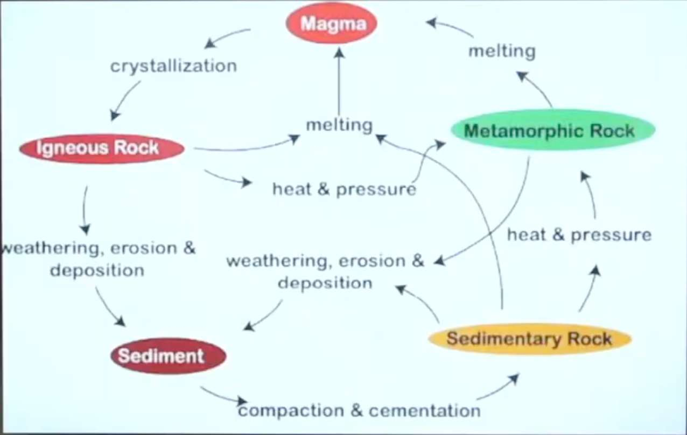
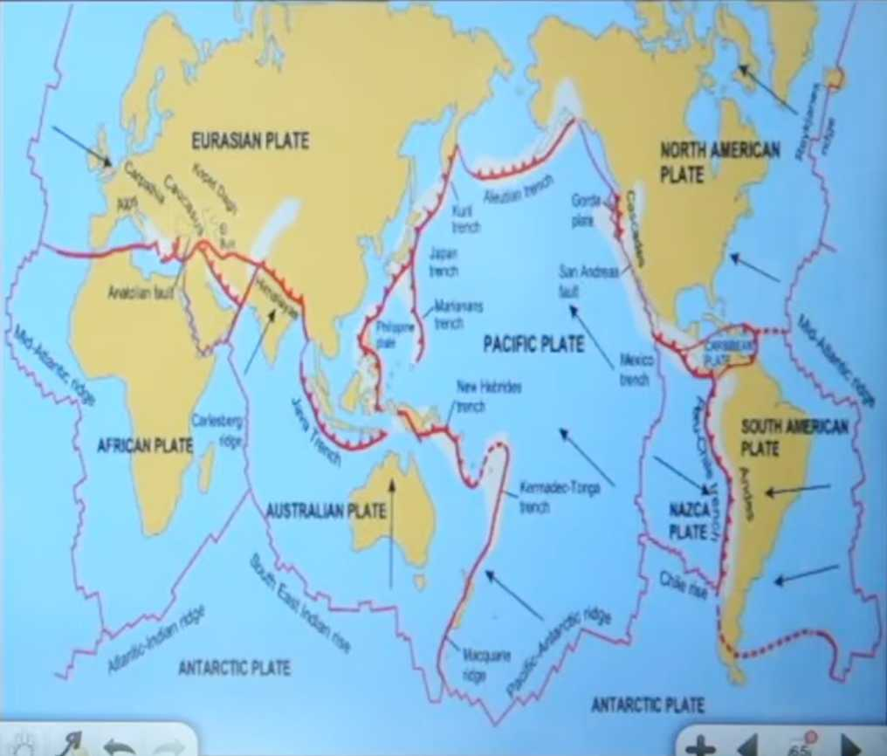

### Rocks

- **Definition**: Aggregate of one or more minerals (e.g., containing iron, aluminium, cobalt, copper).
- Earth's crust composed of rocks (made of multiple minerals).
- Continental plates & oceanic plates exist.
- Soil ≠ Rock; soil is weathered form of rock.
- **Pedogenesis**: Process of rock breaking down to form soil.
- **Pedologist**: Studies soil formation & classification. Subject is called **Pedology**.

#### Types of Rocks

1. **Igneous Rocks (Primary/ Basement Rocks)**

   - Formed from volcanic lava cooling & solidifying.
   - Base of mountains, plains.

2. **Metamorphic Rocks**

   - Formed when igneous rocks subjected to high temperature & pressure → change chemical properties.
   - Example: Granite → Marble.

3. **Sedimentary Rocks**
   - Formed by erosion, transportation, deposition of broken rocks (by river, glacier, groundwater, sea waves).
   - Layers deposited over time.

#### Rock Cycle

- Igneous → (heat + pressure) Metamorphic.
- Igneous/Metamorphic → (erosion + transport + deposition) Sedimentary.
- Sedimentary/Metamorphic → (heat + pressure) Igneous/Metamorphic.
- Igneous formed by magma crystallization (primary).

#### Classification & Examples

- **Igneous**:
  - Intrusive (inside Earth): Granite, Gabbro.
  - Extrusive (outside Earth): Basalt, Andesite.
- **Sedimentary** (often end with "-stone"):
  - Clastic: Conglomerate, Sandstone, Siltstone, Shale.
  - Biological: Coal, Chalk.
  - Chemical: Limestone, Dolostone.
- **Metamorphic**:
  - Foliated (layered): Slate, Schist, Gneiss.
  - Non-foliated: Quartzite, Marble.

### Previous Year Questions (Brief)

- Plate Tectonics misconceptions (CDS 2015).
- Earth's inner core density: ~15 g/cm³.
- Nearest star: Proxima Centauri (other than sun).
- Smallest planet (least mass): Mercury.
- Constellation: Pattern of stars as seen from Earth (not equidistant).

### Geomorphic Processes

- Changes on Earth's surface → landforms.
- Two main types:
  1. **Endogenic** (internal forces): From Earth's interior energy (radioactive elements + primordial heat).
     - Create ruggedness (mountains, plateaus).
     - **Diastrophism**: Slow movements (e.g., plate movement 10 cm/year → Himalayas growing).
     - **Catastrophism - Sudden movements**: Earthquakes, Volcanism.
     - Sub-types:
     - Epeirogeny (vetical - continental building).
     - Orogeny (Horizontal - mountain building),
       - Compression → Fold mountains.
       - Tension → Block mountains.
  2. **Exogenic** (external forces): From outside (sun → rain, wind, etc.).
     - Level the surface (reduce ruggedness created by endogenic).
     - Agents: Running water, wind, glaciers, sea waves.

#### Weathering (Breakdown of Rocks)

- **Physical/Mechanical**: No chemical change.
  - Frost action (water freezes → expands 9% → cracks rock).
  - Temperature changes (expansion/contraction, common in deserts).
  - Pressure release (unloading → expansion).
- **Chemical**: Changes composition and only affects surface. It occurs in hot and humid region.
  - Carbonation (CO₂ + rain → Carbonic acid → dissolves weak particles).
  - Hydration (minerals absorb water → expand).
  - Oxidation (e.g., iron rusts).
- **Biological**: Plants/animals (roots burrow, animals dig).

- Physical: Deep impact, any climate.
- Chemical: Surface only, hot/humid climates.

#### Mass Movement

- Transfer of broken rock downslope under gravity.
- Slow: Soil creep (deserts – sand falls slowly).
- Rapid: Rockfall, landslide, mudflow (with water), earthflow.

#### Erosion & Deposition

- Erosion: Detachment + transport of material.
- Agents: River (fluvial), Groundwater, Glacier, Sea waves, Wind (aeolian).
- Deposition: When agent loses energy. Agents are same.

##### Fluvial (River) Erosion & Landforms

- Stages:
  1. **Youth**: Steep gradient (slope), high erosion.
     - Waterfall, Cascades, V-shaped valley, Potholes, Plunge pool.
  2. **Mature**: Meanders (Ghum Ghum kar age badhna), gentler erosion.
     - Meander path, Oxbow lake (cut-off meander).
  3. **Old**: Low energy, deposition.
     - Delta (or estuary).

##### Groundwater Erosion (Karst Topography)

- When surface water percolate inside rocks, it erodes rocks and flow horizontally. Create caves.
- Dissolves limestone → caves, stalactites (hanging), stalagmites (rising), pillars, columns (Fat pillar).

##### Glaciers Erosion (Strongest – solid-solid friction by weight of ice)

- Cirque (depressed area), Horn (sharp peak), Tarn (lake in cirque).
- Deposition: Drumlins (basket-like hills).

##### Sea Waves Erosion

- Cliffs, arches, stacks (When arch breaks), sandbars (protect from tsunami/cyclones).

##### Wind Erosion (Deserts)

- Aeolian → sand dunes shift (local language: Dhrian).
- Loss of soil fertility. Mostly in desserts.
- Insellberg (isolated pillar in dessert).

### Natural Catastrophes

#### Earthquakes

- Sudden shaking due to energy release. Measured by Sismograph.
- Focus (origin inside), Epicenter (surface point).
- Waves: Body (P & S), Surface (Rayleigh & **Love – most destructive**).
- Causes:
  - Volcanism.
  - Tectonism (coversion, diversion, transform. Plate boundaries).
  - Isostasy (imbalance in crustal weight).
  - Elastic Rebound Theory (Release of stored energy).
  - Anthropogenic factor. (Huge water dams, Nuclear tests)
  - Reservoirs (extra water pressure).
- Distribution: Pacific Ring of Fire, Mid-Continental Belt, Mid-Atlantic Ridge.
- India: 5 zones (Zone 5 highest risk).

#### Tsunami

- Sudden high waves in ocean.
- Causes: Submarine earthquake, avalanche, meteorite.
- Sign: Water recedes first → bulge in middle → rushes back.
- Protection: Coral reefs, mangroves.

### Volcanism & Volcanoes

- **Definition**: Vent/opening (usually circular) through which heated material (gases, liquid, solids) from Earth's interior ejects.
- **Process**: Volcanism.

#### Ejected Materials (in order of ejection)

- Volcanic Gases (lightest): CO₂, SO₂, CO.
- Dust: <0.05 mm.
- Ash: 0.05–0.5 mm.
- Coarse Ash/Cinders: 0.5–4 mm.
- Lapilli: 4–32 mm.
- Bombs/Conglomerates: >32 mm.
- Lava (last): Glowing molten material.

#### Lava Types

1. **Basic (Basaltic)**:

   - Highly fluid, hottest.
   - Dark coloured.
   - Rich in magnesium, poor in silica.
   - Forms shield volcanoes/plateaus.
   - Example: Deccan Plateau (India).

2. **Acidic**:
   - Viscous, less fluid, cooler.
   - Light coloured.
   - Rich in silica.
   - Explosive eruptions.
   - Example: Mt. Pelée.

#### Volcanoes Based on Activity

- **Active**: Frequent eruptions.
  - Example: Stromboli (Lighthouse of Mediterranean).
- **Dormant**: No recent eruption, but may erupt in future.
  - Examples: Mt. Fuji, Mt. Kilimanjaro (highest in Africa).
- **Extinct**: No eruption in historical time, no future signs.
  - Examples: Koh Sultan, Mt. Buninyong.

#### Volcanoes Based on Eruption Type

- **Central Eruption**: From single main vent.
- **Fissure Eruption**: Through long cracks → lava plateaus.
  - Example: Deccan Traps.

#### Volcanic Landforms

1. **Intrusive (inside Earth)**:

   - Batholith: Large dome.
   - Laccolith: Dome-shaped.
   - Lopolith: Bowl-shaped.
   - Phacolith: Wavy.
   - Sill: Horizontal sheet.
   - Dyke: Vertical wall-like.

2. **Extrusive (surface)**:
   - Shield Volcano: Gentle slopes, basic lava.
   - Composite/Strato Cone: Steep, layered (lava + ash).
   - Parasitic Cone: On sides of main cone.

#### Related Geothermal Features

- **Geyser**: Periodic hot water/steam fountain due to pressure build-up.
  - Example: Old Faithful, Yellowstone National Park (USA).
- **Hot Springs**: Continuous hot mineral-rich water flow.
  - Therapeutic/medical benefits (skin diseases, etc.).

#### Distribution

- Same as earthquakes: Pacific Ring of Fire, Mid-Continental Belt, Mid-Atlantic Ridge.

#### Impacts

- **Negative**:
  - Loss of life/property.
  - Lava flows, ash fall, pollution.
  - Climate cooling (ash blocks sun).
  - Example: Krakatoa eruption → island vanished.
- **Positive**:
  - Fertile soils (minerals).
  - Geothermal energy.
  - Mineral deposits.
  - Releases internal heat (prevents Earth overheating).
  - Insights into Earth's interior.
