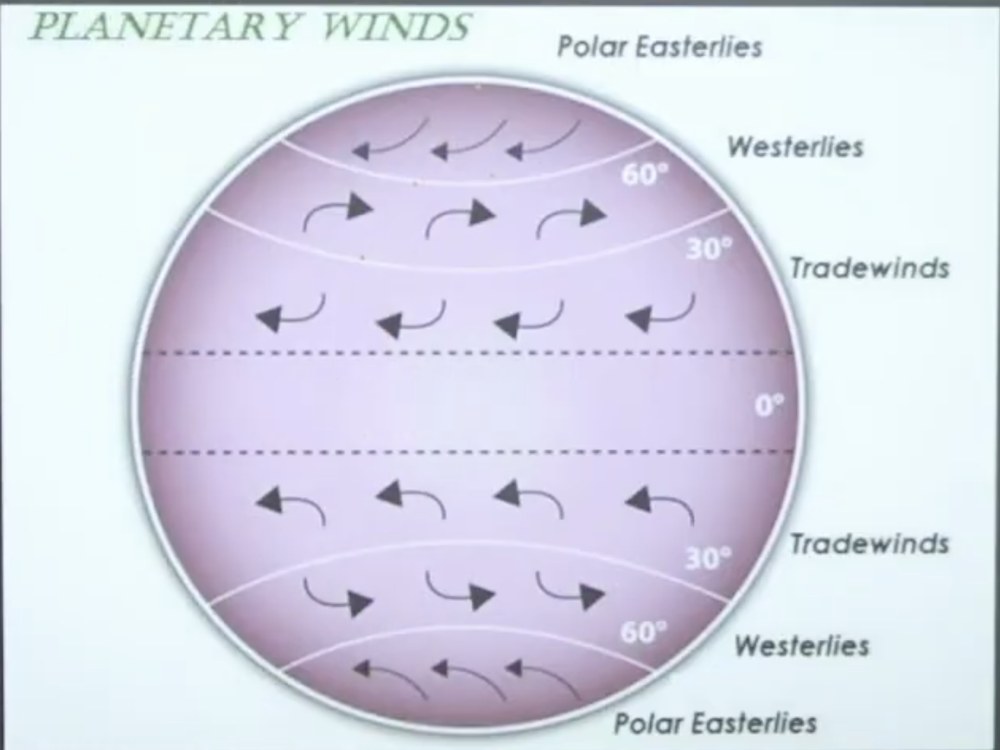

### Revision: Previous CDS Questions

1. Arrange atmosphere layers vertically from Earth's surface (CDS 2015 Part 1).

   - Troposphere -> Statosphere -> Mesosphere -> Thermosphere

2. Ozone important because:

   - Prevents entry of harmful ultraviolet rays (correct answer).

3. Ozone layer found in:

   - Stratosphere (also called Ozonosphere).

4. About atmosphere:
   - No definite upper limit, gradually thins until imperceptible (correct).

### Sources of Energy for Earth's Atmosphere

- Three sources heat atmosphere:
  1. Solar radiation (main).
  2. Endogenetic forces (e.g., volcanic eruptions release hot gases).
  3. Gravity (traps water vapor; allows incoming but blocks outgoing heat → greenhouse effect).

### Insolation

- Earth receives most energy in **short wavelength** form.
- Insolation = Incoming Solar Radiation (short form: "In-so-la-tion").
- Sun rays hit Earth as short waves.

### Mechanism of Solar Radiation

- Energy from Sun's interior: Hydrogen converts to Helium via nuclear fusion (high temperature & pressure).
- Releases energy in wave form.

### Solar Constant

- Amount of solar radiation/energy received per unit area per minute at average Sun-Earth distance.
- Value: ~2 calories/cm²/minute (on average).
- Unit: cal/cm²/min or Langley (measured with instruments).

### Factors Affecting Insolation

1. **Latitude**: Low latitude → high insolation (direct rays); High latitude → low (slanting rays).
2. **Duration of day/night**: Longer day (summer) → more insolation; shorter day (winter) → less.
3. **Distance between Sun & Earth**: Perihelion (closer) → more; Aphelion (farther) → less.
4. **Sunspot cycle**: 11-year cycle affects hydrogen-helium conversion.
5. **Atmospheric conditions**: Dust from satellites/volcanoes blocks rays.
6. **Local weather**: Clouds, fog, mist reduce insolation.

### Solar Radiation Spectrum

- Wavelength increases (GXUVIMR): Gamma rays (shortest) < X-rays < UV < Visible < Infrared < Microwaves < Radio waves (longest).
- Energy inverse: Shorter wavelength → higher energy.

### Heat Budget

- Earth receives 100% solar energy.
- 35% reflected back by atmosphere.
- 14% absorbed by clouds/water vapor/dust.
- 51% reaches Earth's surface.
- Earth releases: 17% direct + 34% via convection/conduction (total 51% absorbed).
- Balance maintained: No net gain/loss → stable temperature.

### Temperature

- Atmosphere heated indirectly by Sun (receives only 14% directly).
- Main heating: Long-wave terrestrial radiation from Earth.
- **Heat transfer processes**:
  1. **Conduction**: Particle-to-particle (in contact, e.g., hot rod).
  2. **Convection**: Bulk movement in fluids (e.g., water vapor rises with latent heat).
  3. **Radiation**: No medium (e.g., heat felt near fire without touch).

### Factors Affecting Temperature

- Same as insolation + extras:
  - Latitude, Altitude (decreases 6.5°C/km → Normal lapse rate).
  - **Temperature inversion**: Temperature increases with height (abnormal; negative lapse rate; common in winter nights).
  - **Distance from sea**: Coastal (maritime) → moderate; Inland (continental) → extreme (e.g., Mumbai cooler than Bhopal in summer).
  - **Ground nature (Albedo)**: Snow/ice → high reflection (90%); Desert sand → medium; Vegetation → low; Black soil → lowest (absorbs most).
  - **Prevailing winds** (e.g., warm winds increase temperature). Chinook - Warm and dry winds.
  - **Ocean currents**: Warm currents raise; cold lower.

### Temperature Distribution

- **Vertical**: Decreases with height (6.5°C/km); Inversion opposite.
- **Horizontal**: Decreases from equator to poles (highest near Tropics, not equator due to daily rain/clouds).
  - Highest recorded: Al Aziziyah, Libya (near Tropic of Cancer).
  - Seasonal shift: Higher in Northern Hemisphere (June-July); Southern (January).

### Atmospheric Pressure

- Temperature outcome: High temp → low pressure (particles expand); Low temp → high pressure.
- Atmospheric pressure: Weight of air column (exerted on a body at sea level: 1013 mb).
- Measured by barometer. Measured as Force per unit area.
- Isobars: Lines joining equal pressure points.

### Pressure Variation with Height

- Pressure decreases with altitude (thinner air).
- At hills: Lower pressure → nosebleed/ear pressure in some.
- Equatorial low pressure (high temp).
- Polar high pressure (low temp).

### Factors Controlling Pressure Systems

1. **Thermal**: Direct temp effect (hot → expand → low pressure).
2. **Dynamic**: Air subsidence/rising creates belts.

### Pressure Gradient

- Pressure difference → air moves high to low.
- Steeper gradient → stronger wind.

### World Pressure Belts

1. **Equatorial Low**: 0-5° N/S; Vertical rays → convection → low; Also ITCZ (Inter-Tropical Convergence Zone); Doldrums (calm).
2. **Sub-Tropical High**: ~30° N/S; Dynamic (air subsidence from equatorial rise); Horse Latitudes (calm, historical horse throwing).
3. **Sub-Polar Low**: ~60° N/S; Dynamic (convergence of winds).
4. **Polar High**: 75° - 90°; Thermal (extreme low temp).

### Atmospheric Cells

- **Hadley Cell**: Equator to 30° (thermal).
- **Ferrel Cell**: 30°-60° (dynamic).
- **Polar Cell**: 60°-90°.
- Equatorial → 0°
  Subtropical → ~30°
  Subpolar → ~60°
  Polar → ~90°

### Coriolis Force

- Apparent force due to Earth's rotation.
- Deflects wind: Right in Northern Hemisphere; Left in Southern.
- Maximum at poles (Slow rotation speed, more deflection).
- Zero at equator(Fast rotation speed, no deflection).

### Atmospheric Circulation & Winds

- Types:

  1. Primary/Planetary: Constant direction (Trade, Westerlies, Polar).
  2. Secondary/Seasonal: Change with season (Monsoon, Cyclones).
  3. Tertiary wind: Local and Diurnal wind.

- **Planetary Winds**:
  - Trade Winds (Easterlies) : Sub-tropical High to Equatorial low. Deflected to right (E to W) in Northern Hemisphere. And Deflected to left (E to W) in Southern Hemisphere. Comes from East.
  - Westerlies: Sub-tropical high to sub-polar low (Right in North (W to E) ; Left in South (W to E)).
  - Polar Easterlies: Polar high to sub-polar low (E to W).
- Southern Hemisphere special: Roaring Forties (40°S), Furious Fifties (50°S), Shrinking Sixties (60°S) – fast due to less land.

Image -planetary-winds

- **Seasonal Winds**: Monsoon (June to Sept) (SW summer → rain; NE winter → dry, rain in Tamil Nadu).

### PYQs

- Chemical weathering happens at a greater pace in hot and humid climate.
- Lemu is found in only Madagascar and Wester ghat.
- Limnology refers to study of Lakes and Ponds.
- Deepest Lake of world is Lake Baikal (Russia). Lake Chillika in Orrisa India, Dull Lake in Kashmir, Lake Sambhar in Rajasthan which is largest Salt Lake of India.
- Isotherm line joins equal temp. Isobar join equal Pressure. Isohaline joins equal Salinity. Isohyet join equal rainfall.
- Insolation is most important factor to influence temperature on earth.
- Horizontal wind circulation is due to all Pressure gradient, Friction force and Coriolis force.
