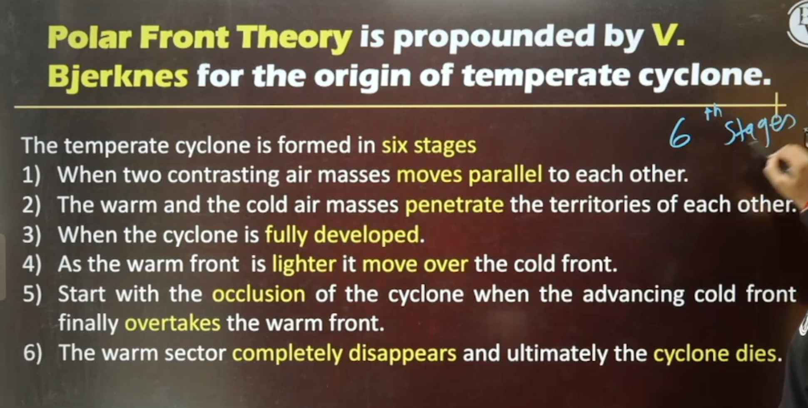

### Session Overview

- Climatology = Hydrology + Atmospheric Science (due to 4-5% water vapor in atmosphere by volume).

### Local Winds

- **Definition**: Winds generated due to local climatic conditions (temperature/pressure differences in specific areas).
- **Mechanism**: Temperature difference → pressure difference → horizontal air movement (advection).
- **Examples**:
  - **Loo**: Hot & dry; blows in Northern Plains (UP, Bihar, Jharkhand, Punjab, Haryana) in summer.
    - Also called Kal Baisakhi in West Bengal.
  - \*_Simoom_: Hot wind in Arabian Peninsula (Largest peninsula).
  - **Sirocco**: Hot & dry; from Sahara Desert (Picks up red sand) → Mediterranean Sea (gains moisture) → Italy (causes blood rain due to red sand).
  - **Levantar**: Hot showers in Kerala/Karnataka (pre-monsoon mango showers → ripens mangoes, jamun, etc.).
  - **Khamsin**: Warm and dry wind in Egypt.
  - **Mango Shower**: Pre monsoon shower in Kerela and Karnataka.
  - **Chinook**: Warm & dry; Rocky Mountains (North America) → raises temperature ~4-5°C; also called "snow eater".
  - **Foehn**: Dry and warm in North slope of alps.
  - **Harmattan (Africa)**: Warm & dry; relieves stressful hot atmosphere.
  - **Brickfielder**: Hot; Victoria Desert, Australia.
  - **Shamal**: Hot & dry; Iraq (Mesopotamia region).
  - **Blizzard**: Cold storm; Siberia (also called "Bear from East").
  - **Mistral**: Cold & dry; France → Spain. To Gulf of Lion.
  - **Yoma**: Warm; Japan.
  - **Haboob**: Hot & stormy; Sudan (brings desert dust).
  - \*Bise\*\*: France and Switzerland.
  - **Black Roller**: Hot & Dusty; North America.

### Diurnal Winds

- Specific heat, energy required to increase temp.
- Winds changing direction twice a day due to land-sea heating difference.
- **Sea Breeze (Day)**: Land heats faster (lower specific heat) → low pressure on land → wind from sea (high pressure) to land.
- **Land Breeze (Night)**: Land cools faster → high pressure on land → wind from land to sea.

### Mountain & Valley Breezes

- **Valley Breeze - Anamatic (Day)**: Valley heats faster → low pressure → air rises from valley to mountain.
- **Mountain Breeze (Night)**: Mountain cools faster (higher altitude, normal lapse rate) → high pressure → air descends to valley.

### Iso-Lines (Important Map Lines)

- **Isohype**: Equal elevation.
- **Isobath**: Equal depth in sea.
- **Isodapane**: Equal transport cost.
- **Isohaline**: Equal salinity in ocean.
- **Isohel**: Equal sunshine duration.
- **Isohyte**: Equal rainfall.
- **Isoneph**: Equal cloud cover.
- **Isophyte**: Equal height of plants.
- **Isoseismal**: Equal earthquake intensity.
- **Isotherm**: Equal temperature.
- **Isobar**: Equal pressure.
- **Contour**: Equal height.

### Humidity

- **Definition**: Amount of water vapor in air (colloquial: "umass").
- Atmosphere contains 4-5% water vapor by volume.
- Varies seasonally (higher in summer due to evaporation) and spatially (high near equator, low in deserts).
- **Maximum Humidity**: Between 10°N-10°S (equatorial region → high temperature → high evaporation).
- **Sources**: Evaporation (directly proportional).
- **Factors Affecting**:
  1. Temperature (higher → more evaporation → higher humidity).
  2. Wind speed (spreads moisture → increases).
  3. Surface area (larger water bodies → more evaporation).
- **Types**:
  1. **Absolute Humidity**: Water vapor (grams) per unit volume (cubic meter); changes with temperature.
  2. **Specific Humidity**: Water vapor (grams) per kg of air; not affected by temperature.
  3. **Relative Humidity**: Ratio of actual water vapor to maximum air can hold (in %); rain likely >90-94%. Decreases with temperature because volume increases but water remains same.

### Condensation

- **Definition**: Water vapor transforms to liquid/solid (gas → liquid/solid).
- **Process**: Occurs when temperature falls (inverse to temperature) and relative humidity rises (proportional to relative humidity); around dust particles (hygroscopic nuclei).
- **Forms**:
  - Dew: Liquid droplets on leaves/ground (cool nights).
  - Frost: Direct solid (frozen dew; temperature <0°C).
  - Fog: Microscopic water droplets near surface (visibility <1 km).
  - Mist: Similar to fog (visibility >1 km but reduced).
  - Clouds: Aggregation of tiny water droplets/ice high above surface (due to condensation around hygroscopic nuclei).

### Clouds

- **Role**: Significant in heat budget (absorb 14% insolation); reduce surface insolation.
- **Classification by Height**:
  1. High (6-12 km): Cirrus (feathery, beautiful; indicate dry weather; cause halo).
     - Cirrocumulus: White flecks (ripple like desert sand).
     - Cirrostratus: Thin layer (sun/moon visible with halo).
  2. Middle (2-6 km): Altostratus (grey/blue sheet; sun/moon obscured).
     - Altocumulus: Layered (milk cream-like).
  3. Low (<2 km): Stratus (dense layers; cause drizzle; winter common).
     - Nimbostratus: Dark, low; torrential rain.
     - Cumulus: Cotton-like, flat base; fair weather.
     - Cumulonimbus: Vertical, dome-shaped; thunderstorms/heavy rain.

### Precipitation

- **Definition**: Saturated clouds release moisture (rain, snow, etc.).
- **Forms**:
  - Rainfall (liquid).
  - Snowfall (flakes; temperature <0°C).
  - Sleet (rain + ice mix).
  - Hail (ice balls; damaging to crops, common in Rabi season).
  - Virga (rain evaporates before reaching ground).
- **Measurement**: Rain gauge (cm rainfall in 24 hours).
- **Isohyet**: Lines joining equal rainfall areas.

### Types of Rainfall

1. **Convectional**: Heating → evaporation → rising air → clouds → drizzle (common daily).
2. **Orographic**: Moist air blocked by mountain → rises → cools → heavy rain on windward side; dry on leeward (rain shadow).
   - Example: Western Ghats (heavy on west; dry east).
3. **Frontal/Cyclonic**: Warm & cold air masses meet → warm rises → condensation → rain.
4. **Artificial**: Cloud seeding with silver iodide → forced condensation.

### Cyclones

- **Definition**: Closed low-pressure system with increasing pressure outward; violent storms.
- **Vs Anticyclone**: Center high pressure → stable weather.
- **Types by Location**:
  1. **Tropical Cyclones**: Violent; originate over tropical oceans.
     - Direction: East to West (trade winds influence).
     - Rotation: Anticlockwise (NH); Clockwise (SH) due to Coriolis.
     - Names: Typhoon (China Sea); Hurricane (Atlantic); Cyclone (Indian Ocean); Willy-Willies (Australia).
     - Conditions: Sea temperature >27°C; continuous warm moist air; latent heat.
     - Structure: Eye (calm center); Eye wall (violent); Diameter 150-250 km.
     - Impacts: Heavy rain, coastal damage, loss of life/property, mangrove/coral destruction.
     - Naming: 13 countries (Indian Ocean rim) cycle through 169 names.
  2. **Temperate/Extratropical Cyclones**: Larger (1500-2500 km); frontal origin; slower (15 km/h).
     - When two airmasses collide front formed. Process is called Frontogenises.
     - 4 types of front - Stationary, Cold, Warm, Occluded.
     - Associated with light drizzle over large areas.

### Tornado

- Local violent storm; small but devastating, Funnel in shape.
- Also: Waterspout (over water); causes fish fall.

### Questions & Answers

- Coriolis effect: Due to Earth's rotation.
- Cyclonic storm in China Sea: Typhoon.
- Center of cyclone: Eye.
- Most cyclone-prone in India: Jagannath Puri.
- Atlantic tropical cyclones: Hurricanes.
- "Yaas" cyclone name: Oman.
