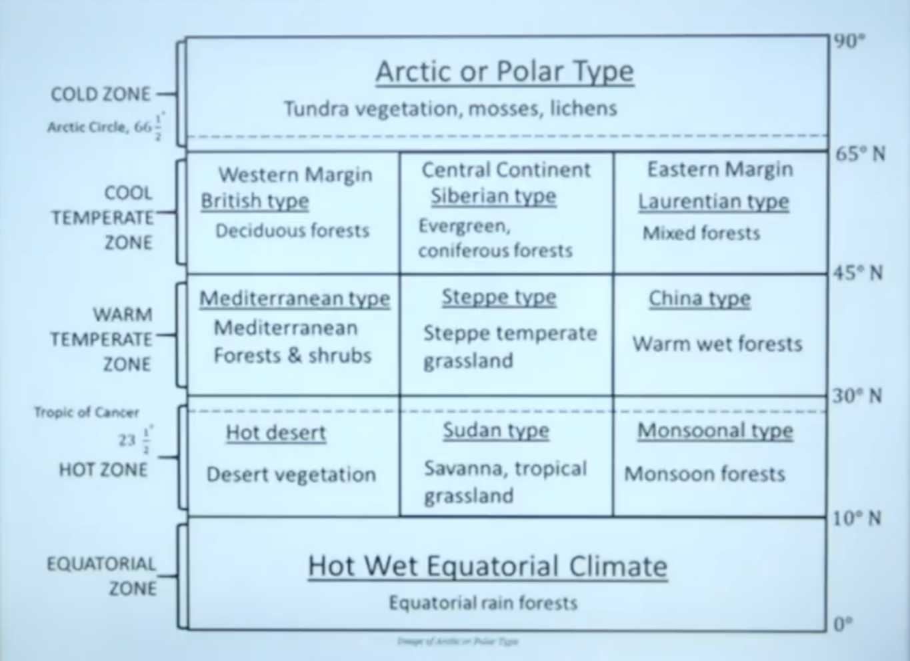

### World Climatic Regions

- **Climate Definition**: Long-term average of temperature, humidity, rainfall, cloud cover in a region.
- **Classification Basis**: Primarily temperature (5 major zones); further subdivided.
  1. **Mega Thermal (Hot, no winter)**: >18°C year-round.
  2. **Xerophyte**: Dry climate, where evaporation exceed precipitation.
  3. **Mesothermal (Mild winter)**: 8-18°C average.
  4. **Microthermal (Cool climate)**: Winter < -3°C, summer ~10°C.
  5. **Hekistotherm**: Polar; Extreme; Always <10°C.
  6. **Others**: Desert, steppe variations.

#### Major Regions (Latitude-wise Distribution)

- **0°-10° (Equatorial)**: Hot wet equatorial.
- **10°-30°**:
  - Tropical savanna (Sudan type).
  - Tropical monsoon.
  - Hot desert (western continental margins).
- **30°-45°**:
  - Mediterranean (western margins).
  - Steppe (central).
  - China/Gulf type (eastern margins).
- **45°-65°**:
  - British type (western oceanic).
  - Siberian type (central continental).
  - Laurentian type (eastern).
- **65°-90°**: Arctic/Tundra/Polar.

Image - climate types

#### 1. Equatorial Climate

- Location: 5°N-5°S (Amazon, Congo, Malaysia/Indonesia basins).
- Temperature: Uniform high (>18°C); no winter.
- Precipitation: 150-250 cm/year; convectional; no dry month; peaks post-equinox (April/October heavy rain globally; local peaks 1 month after solstice).
- Vegetation: Multi-layered rainforest (emergent, canopy, understory, shrub, forest floor); multiple species.
- Animals: Jaguar, python, anaconda, butterflies, spiders.
- Tribes: Pygmy (Congo), Orang Asli/Semang (Malaysia), Amazon indigenous (rubber collectors). Hunters.
- Economy: Shifting cultivation (jhum/ladang); net timber importer (diverse woods, hard to exploit single type); cocoa/chocolate raw material.

#### 2. Savanna (Sudan Type) Climate

- Location: Sudan region; South America (Llanos Orinoco, Campos Brazil), Africa, Australia (Downs).
- Called: Big game/Parkland country.
- Precipitation: 80-110 cm; medium; rainy season NH May-Sep, SH Oct-Mar.
- Temperature: Day hot, night cool.
- Vegetation: Tall grasses (elephant grass); umbrella-shaped trees (broad trunk).
- Ecotone. A area where two different ecosystems meet.
- Animals: Lion, tiger, hyena, leopard, cheetah (carnivores); zebra, antelope, giraffe, deer, elephant (herbivores).
- Regions: North america, Mid africa and central part of India.
- Tribes: Maasai (hunters, economic activity: pastoralists), Hausa (permanent agriculture).

#### 3. Tropical Monsoon Climate

- Location: 5-30° (onshore winds); India, SE Asia (Burma, Thailand, Laos, Cambodia, Vietnam, S China), N Australia, E South America, Mexico.
- Precipitation: 200-250 cm; summer heavy (monsoon). Highest rainfall in Cherrapunji and Mawsynram.
- Temperature: Summer 30-45°C, winter 15-30°C (min ~25°C).
- Vegetation: Deciduous trees shed leaves in dry season (sal, teak, eucalyptus, acacia).
- Agriculture: Wet paddy (rice), wheat, jowar, mustard, soybean, pulses; cash crops (jute WB, coffee Karnataka, sugarcane UP).
- Tribes:
  Gond (Madhya Pradesh, Chhattisgarh, Maharashtra – Satpura & Bastar region)
  Bheel / Bhil (Madhya Pradesh, Rajasthan, Gujarat – southern MP & Aravalli belt)
  Baiga (Madhya Pradesh – Maikal hills, Mandla–Balaghat)
  Santhal (Jharkhand, West Bengal, Odisha, Bihar)
  Munda (Jharkhand, Odisha, Chhattisgarh)
  Soliga (Karnataka – Biligiri Rangan Hills, Nilgiri biosphere)
  Kol / Koll (Uttar Pradesh, Madhya Pradesh, Chhattisgarh)
  Kuki (Manipur, Mizoram, Tripura)
  Tharu (Uttarakhand, Uttar Pradesh – Terai region)
  Bharia / Bhariya (Madhya Pradesh – Patalkot, Chhindwara)
  Saharia / Sahariya (Madhya Pradesh – Sheopur, Kuno–Palpur National Park region)
  Korku (Madhya Pradesh, Maharashtra – Satpura range)
  Chutia (Assam – Upper Assam region)

#### 4. Tropical (Hot) Desert Climate

- Location: Western continental margins 15-30°.
- Reason: Trade winds not able to bring moisture at west coast. Cold ocean currents. Subsidence air from eq.
- **Major Deserts:** Sahara (North Africa), Arabian (Arabian Peninsula – SW Asia), Iranian (Iranian Plateau – Iran), Thar (India–Pakistan border), Kalahari (Botswana–Namibia–South Africa), Namib (Namibia – SW Africa, Atlantic coast), Great Australian Desert (Western & Central Australia) & Mojave (South-western USA & north-western Mexico).
- Precipitation: <25 cm (Atacama ~0).
- Temperature: Day >30°C, night cold (high albedo).
- Vegetation: Xerophytes (drought-resistant: cactus, acacia).
- Tribes: Bushmen (Kalahari hunters), Bindibu (Australia), Tauregs (sahara), Gobi mongols (Gobi).

#### 5. Mediterranean Climate

- Location: 30-45° western margins (Mediterranean Sea, S Australia/Adelaide, S Africa/Cape, California, Chile).
- Precipitation: 35-90 cm; mostly winter (westerly cyclones).
- Temperature: Hot dry summer (>22°C), mild wet winter.
- Vegetation: Broad evergreen leaves; orchards. Oak, Eucalyptus, Pine, Fir. Birch and Cedar.
- Economy: Orchard land (citrus: orange, lemon; grapes (85%) /wine - viticulture).

#### 6. Steppe Climate

- Location: 30-45° continental interiors.
- Precipitation: ~45 cm.
- Temperature: Extreme variation.
- Vegetation: Short fresh grasses (treeless). Alpha- Alpha grass.
- **Grasslands**: Pustaz(Hungary) Prairies (N America), Pampas (Argentina), Veld (S Africa), Downs (Australia), Canterbury (NZ).
- Economy: Livestock rearing, dairy, meat. Granaries of the world - Prairies
- Tribes - Kirghiz, Kazakhs

#### 7. China/Gulf Type Climate

- Location: 20-35° eastern margins.
- Precipitation: 60-150 cm; uniform (monsoon + cyclones).
- Temperature: Moderate.
- Vegetation: Deciduous, Natural vegetation luxuriant vegetation. Pines and Cypresses are imp softwoods.
- Agriculture: Rice (1/3 world in China), cotton, corn.

#### 8. British Type Climate

- Location: 45-65° western oceanic margins (Britain, NW Europe).
- Temperature: Mild (5-15°C).
- Precipitation: Moderate, well-distributed.

#### 9. Siberian Type Climate

- Location: 50-70° central continental (Siberia, Canada, Russia).
- Temperature: Extreme cold winter (-30 to -40°C), mild summer (20-25°C). Lowest temp Verkhoyansk (Siberia).
- Precipitation: Winter snow.
- Vegetation: Coniferous taiga forest.
- Animals: Siberian tiger.

#### 10. Laurentian Type Climate

- Location: North America (Canada, NE USA, E Russia).
- Temperature: Cold winter, warm summer.
- Precipitation: Year-round (polar easterlies).
- Economy: Lumbering, fishing.

#### 11. Tundra/Arctic/Polar Climate

- Location: >65° (Arctic Circle N, Antarctic Circle S).
- Temperature: <0°C most year; summer brief/warm.
- Precipitation: Snow/sleet; low.
- Vegetation: Mosses, lichens (no trees).
- People: Eskimo (coastal; igloo in winter; hunting/fishing).

### Questions & Answers

- Rocky Mountains east grasslands: Prairies.
- Campos/Llanos: South America savanna.
- Temperate grasslands South America: Pampas. Vleds in Africa.
- Equatorial tribe: Pygmy.
