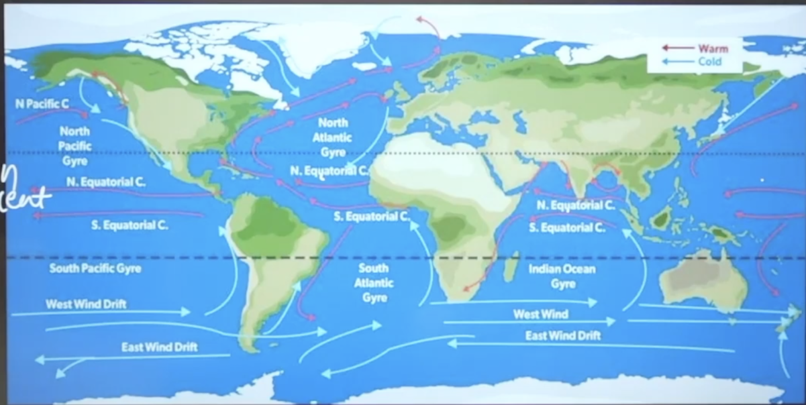
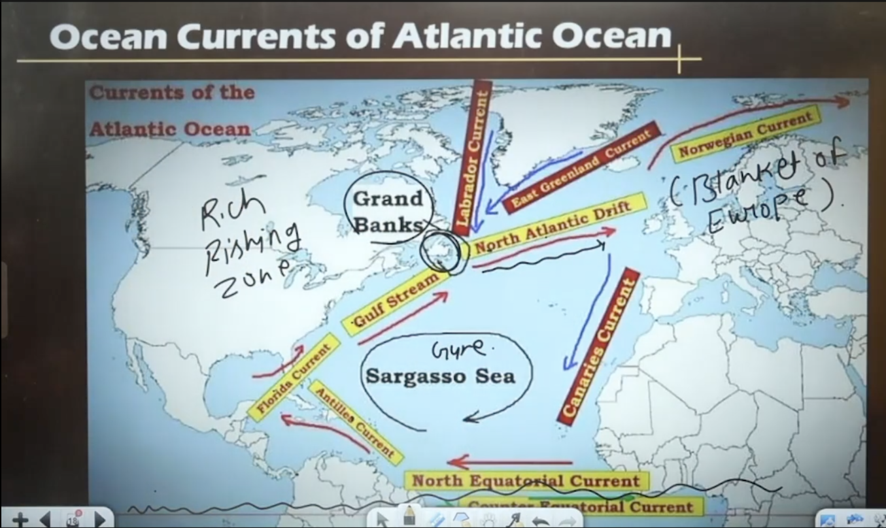
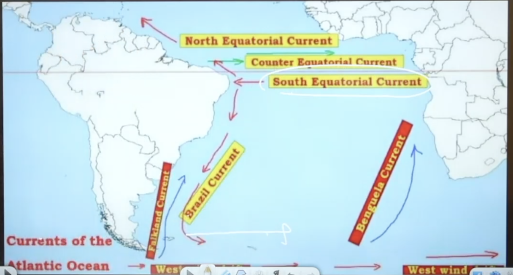
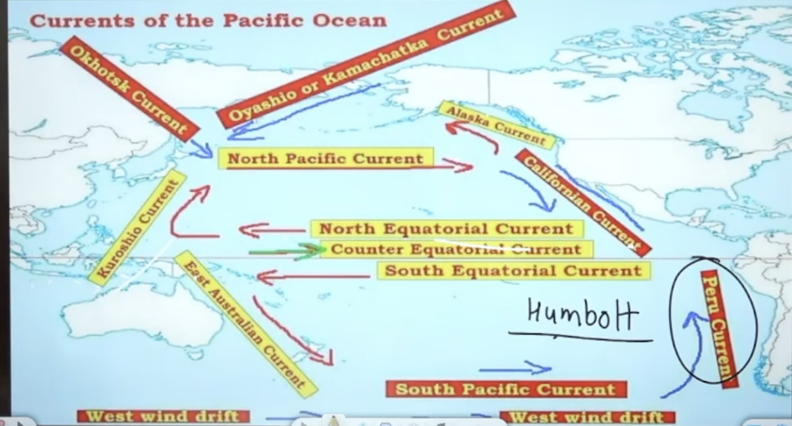
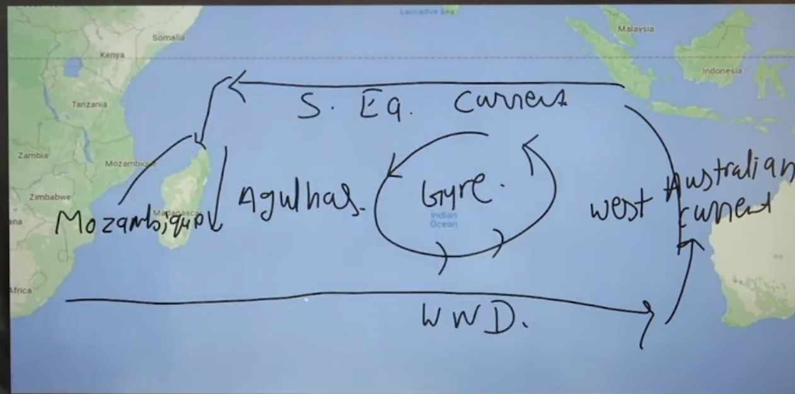

### Movement of Ocean Water

#### 1. Types of Ocean Water Movement

- **Horizontal Movement**:
  - Ocean Currents (main focus).
  - Waves.
- **Vertical Movement**:
  - Tides.
  - Tsunami (previously discussed; exam-important).

#### 2. Ocean Waves

- **Cause**: Oscillatory motion due to wind blowing over ocean surface.
- **Mechanism**:
  - Wind pushes water down → water rises back due to Newton's 3rd Law (action-reaction).
  - Results in rise (crest) and fall (trough) of water.
- **Parts**:
  - Crest (upper part).
  - Trough (lower part).
  - Distance between two crests/troughs: **Wavelength** (λ).

#### 3. Ocean Currents (Imp)

- **Definition**: Horizontal movement of large mass of ocean water in a definite direction (like rivers in ocean).
- **Classification**:
  - **By Temperature**:
    - Warm Currents (higher temperature; from equator to poles).
    - Cold Currents (lower temperature; from poles to equator).
  - **By Velocity**:
    - Drift (slow movement).
    - Current (medium speed).
    - Stream (fastest; e.g., Gulf Stream).
- **Color Coding in Maps (Most imp) **:
  - Red: Warm currents.
  - Blue: Cold currents.

##### 3.1 Origin/Factors Influencing Ocean Currents

- **Temperature Difference**:
  - Equator: Perpendicular insolation → higher temperature.
  - Poles: Slanting insolation → lower temperature.
  - Thermodynamics: Warm water moves to cold regions; cold water to warm → balances global heat.
- **Salinity Difference**:
  - Higher salinity → denser water → influences movement to maintain balance.
- **Earth's Rotation (Coriolis Effect)**:
  - Earth rotates west to east → currents deflect (east to west in low latitudes).
- **Prevailing Winds**:
  - Trade Winds: Push currents east to west near equator.
  - Westerlies: Push currents west to east in mid-latitudes.
- **Coastline Configuration**:
  - Currents flow parallel to coast when blocked (e.g., turns along landmass).
- **Exam Tip**: Currents NOT caused by Earth's revolution around Sun (only rotation matters). Common wrong statement in MCQs.

##### 3.2 Atlantic Ocean Currents

- **North Atlantic**:
  - North Equatorial Current → Gulf of Mexico branch (Florida Current) + outside branch (Antilles Current) → merge into **Gulf Stream** (warm, fast stream).
  - Cold currents: Labrador Current (north to south), East Greenland Current. Come from poles.
  - Collision (Gulf Stream + Labrador/East Greenland): **Grand Banks** – rich fishing ground (fog + nutrient upwelling).
  - Gulf Stream → North Atlantic Drift (eastward due to easterlies) → Warm current splits into Norwegian Current (northward to the Arctic; “blanket of Europe”, warms Western Europe, melts ice)
  - Cold return currents: Labrador Current + East Greenland Current → (eastward) which further give rise to the Canary Current (southward along NW Africa)
  - Enclosed sea: **Sargasso Sea** (no coastline; bounded only by currents). The complete circle is called **Gyre**.
  - **Sea weed** is found in Sargasso Sea.

- **South Atlantic**:
  - South Equatorial Current → Brazil Current (warm).
  - Cold: Falkland Current.
  - West Wind Drift (Westerlie influence) → Benguela Current (upward) + others. Complete circle is Gyre.
  - Collision: Fog-prone, accident risk.

##### 3.3 Pacific Ocean Currents

- **North Pacific**:

  - **North Equatorial Current** (warm; westward) → hits Philippines/Japan → becomes **Kuroshio Current** (warm, northward)
  - **Kuroshio collides with cold currents from north**: **Oyashio / Kamchatka Current + Okhotsk Current** → forms **North Pacific Current** (eastward)
  - **North Pacific Current bifurcates**:
    - North → **Alaska Current** (warm)
    - South → **California Current** (cold)

- **Equatorial Belt**:

  - **Counter Equatorial Current** (eastward; balances water pushed west by trade winds)

- **South Pacific**:

  - **South Equatorial Current** (warm; westward) → **East Australian Current** (warm, southward)
  - Collides **with West Wind Drift** Turns east as **South Pacific Current**
  - **South Pacific Current bifurcates**:
    - North → **Peru / Humboldt Current** (cold; west coast of South America)
    - South → **West Wind Drift**

- **Key Point**:
  - **Warm–cold current collisions → rich fishing grounds**

##### 3.4 Indian Ocean Currents

- **Uniqueness**:

  - Only ocean with **seasonal current reversal** (monsoon-controlled)
  - **No cold current from north** (Asia blocks flow)

- **Northern Indian Ocean (Seasonal)**:

  - **SW Monsoon (summer)**: Southwest Monsoon Current (W → E)
  - **NE Monsoon (winter)**: Northeast Monsoon Current (E → W)

- **Southern Indian Ocean (Permanent – single gyre)**:
  - **South Equatorial Current** (warm; E → W)
  - Splits into **Mozambique Current** + **Agulhas Current** (warm; SE Africa)
  - **West Wind Drift** (cold; E → W, southern boundary)
  - **West Australian Current** (cold; N along W Australia)
  - → together form **clockwise Southern Indian Ocean gyre**

##### 3.5 Significance of Ocean Currents

- **Climate**: Warm → warming effect; Cold → cooling effect.
- **Rainfall**: Warm currents bring moisture → coastal rain.
- **Desert Formation**: Cold currents reduce temperature → high pressure → no rain (e.g., Canary Current → Sahara; Peru Current → Atacama).
- **Fishing Grounds**: Warm + Cold collision → upwelling → nutrients → rich fishing (Grand Banks, Newfoundland; Japan coast; additional: Peru coast – anchovies).
- **Navigation**: Sailing with current (east-west) faster, fuel-efficient.

#### 4. Tides (Vertical Movement)

- **Cause**: Gravitational pull of Moon + Sun; centrifugal force of Earth. Study - **Tidology**.
- **Types (based on Moon-Sun-Earth position)**:
  - **Spring Tides** (high amplitude):
    - Conjunction (Sun-Moon-Earth aligned; Moon between).
    - Opposition (Earth between Sun-Moon; 180° angle).
  - **Neap Tides** (low amplitude): 90° angle (quadrature).
- **Perigee (Moon closest)**: Higher tides.
- **Apogee (Moon farthest)**: Lower tides.
- **Tidal Bore**: River water pushed back by tide → wave in river (helps navigation).
- **Uses**:
  - Navigation: High tide allows ships in shallow ports.
  - Tidal Energy: Water movement rotates turbines → electricity.
- **Red Tide**: Biological (red algae bloom; e.g., South China Sea).

#### 5. Ocean Deposits (Sediments on Ocean Floor)

- **Sources**:
  - **Natural**:
    - River sediments (silt, quartz, clay).
    - Marine erosion (waves).
    - Atmospheric dust (cyclones).
    - Volcanic eruptions (ash, lava).
    - Phytoplanktons and zooplanktons
  - **Man-made**:
    - Industrial waste.
    - Urban waste (coastal cities).
    - Agricultural runoff (fertilizers, pesticides → eutrophication, high BOD).
    - Flotsams; Shipwrecks.
    - Space debris.
- **Types**:
  - **Terrigenous** (land-derived; rivers; near continents).
  - **Pelagic** (ocean-derived; 75% ocean floor; shells/skeletons of marine organisms; organic + inorganic).
  - **Glacial** (high latitudes; icebergs melt → deposit debris).
  - **Volcanic** (from underwater volcanoes).

#### 6. Marine Time Zones / UNCLOS 1982 (Law of the Sea)

- **Zones from Baseline**:
  1. **Internal Waters**: Inside baseline (full sovereignty).
  2. **Territorial Sea**: 12 nautical miles (full sovereignty).
  3. **Contiguous Zone**: Next 12 miles (up to 24 nm; customs, immigration control).
  4. **Exclusive Economic Zone (EEZ)**: Up to 200 nm (resource rights; fishing, mining).
  5. **High Seas**: Beyond EEZ (equal rights for all nations).

#### Exam Questions/Examples Covered

- Sargasso Sea: No coastline.
- Gulf Stream: Warm ocean current.
- Canary Current: Cold.
- Humboldt/Peru Current: Cold; causes El Niño.
- Agulhas Current: Indian Ocean.
- Yellow Sea color: Silt from Huang He River.
- Photic Zone: Sunlight penetrates.
- Thermocline: Sharp temperature decline layer.
- Chihuaha is largest desert in North america.
- Cantebury grassland in New Zealand.
- Additional (knowledge): Kenya Current (cold, Indian Ocean); Benguela Current (cold, desert formation).
