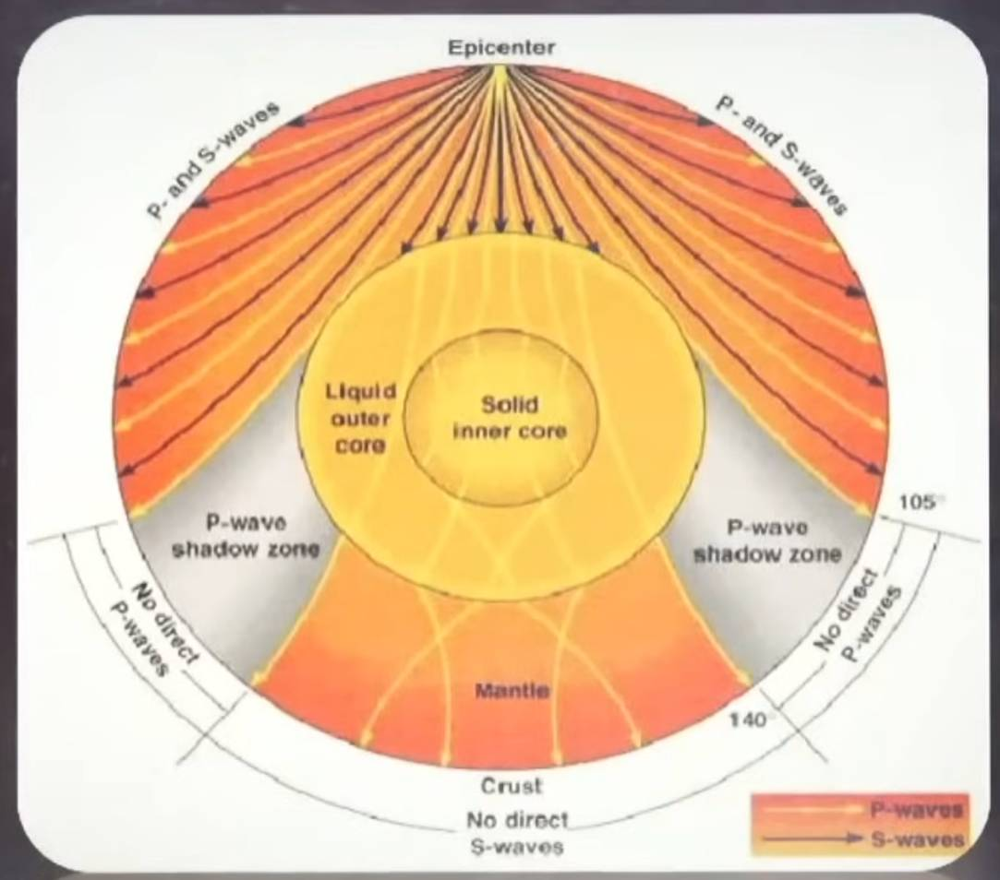

### Geomorphology

### Key Topics Covered

#### 1. **Introduction to CDS Geography**

- Geography and Environment together contribute approximately 24-25 questions out of 120 in CDS exams.
- Emphasis on understanding question patterns, particularly scenario-based questions (e.g., river crossings during journeys, honeymoon destinations based on climatic preferences).
- Focus on conceptual clarity rather than rote memorization (e.g., river origins vs. practical river crossing knowledge).

#### 2. **Universe and Cosmology**

- **Origin of the Universe:** Explained via the **Big Bang Theory (By Georges Lemaître in 1927)** (13.6 billion years ago), involving expansion from a tiny, dense dot. Evidence was given by **Edwin Hubble**.
- The universe consists of energy, physical matter, and time.
- Within 3 lakh years, Temp dropped to 4500K. Condensation took place, stars and planets formed.
- Introduction to **light year** as a unit of cosmic distance.
- A light-year is a unit of distance, not time, representing how far light travels in a vacuum in one Julian year (365.25 days). It's an enormous length, \(9.46\times 10^{12}\) km, used to measure vast distances between celestial objects in astronomy.
- Structure hierarchy: Universe → Galaxy clusters → Milky Way Galaxy → Solar System (In Orion arm) → Earth → Continents → Countries → States → Cities.
- The Milky Way galaxy houses the solar system, centered not on the Sun but on the galactic core.

#### 3. **Solar System**

##### ☀️ **Sun (Star)**

###### 📍 **General Facts**

- Located at the **center of the Solar System**
- Position in Milky Way: **Orion Arm**
- **Solar Revolution:** Earth revolving around the Sun
- **Galactic Revolution:** Sun revolving around the Milky Way galaxy
- Age: **~5 billion years**
- Core temperature: **~15 million °C**
- Density at Sun’s center: **~100 g/cm³**  
  _(Earth’s average density ≈ 5 g/cm³)_

###### ⚛️ **Composition & Energy**

- Mainly composed of **Hydrogen and Helium**
- Energy produced by **nuclear fusion**

###### 🧩 **Layers of the Sun**

**Internal Layers**

1. **Inner Core**
   - Central region
   - Nuclear fusion occurs
2. **Radiative Zone**
   - Energy transferred by radiation
3. **Convection Zone**
   - Energy transferred by convection currents
4. **Subsurface Layer**
   - Transition layer below surface

**Surface & Atmospheric Layers** 
5. **Photosphere (Surface)**
   - Visible surface
   - Emits sunlight

6. **Chromosphere (Atmosphere)**
   - Reddish layer above photosphere
   - Seen during solar eclipse
7. **Corona (Outer Atmosphere)**
   - Outermost layer
   - Extremely hot, source of solar wind

###### 🌈 **Solar Radiation**

- Gamma rays, X-rays, Ultraviolet rays, Visible light, Infrared, Microwaves, Radio waves
- _(Most harmful radiation blocked by Earth’s atmosphere)_

##### **Planets**

- A celestial body moving in elleptical orbit around a star is known as a planet. Planters are separated by a Asteroid belt. Kuiper belt is outer most belt. All planets come inside Kuiper belt including Pluto.
- **8 Planets:** Mercury, Venus, Earth, Mars, Jupiter, Saturn, Uranus, Neptune

##### 🪨 **Inner Planets (Till Mars)**

- Called **Terrestrial Planets**
- Rocky in nature
- Small in size
- High density
- Fewer moons
- Largest is Earth in inner planets.

##### 🌪️ **Outer Planets (After Mars)**

- Called **Jovian Planets**
- Gaseous
- Very large in size
- Low density
- Many moons

##### 🌙 **Natural Satellites**

- **Ganymede** → Largest natural satellite (of **Jupiter**)
- **Phobos & Deimos** → Satellites of **Mars**

##### 🌌 **Aurora**

- Also called **Northern & Southern Lights**
- Caused by **solar storms**
- Interaction of solar particles with **Earth’s magnetic field**
- Visible near **polar regions**

#### 4. **Earth and Physical Geography**

- Earth is called the **Blue Planet** due to its water coverage.
- Earth's magnetic field protects life by deflecting harmful solar radiation.
- Earth’s structure:
  - **Crust** (outer layer)
  - **Mantle** (middle layer)
  - **Core** (innermost layer)
- Rotation on its axis (360° in 24 hours) causes day and night.
- Revolution around the Sun (365.25 days) causes seasons.
- Distinction between **solar day (24 hours)** and **sidereal day (~23h 56m)**.
- Concepts of **perihelion** (closest to Sun) and **aphelion** (farthest from Sun).
- Solar phenomena like **solstices** (Summer and Winter) and **equinoxes** (March and September) explain seasonal changes.

#### 5. **Latitude and Longitude**

##### **Latitude**

- Angular distance north or south of the Equator (0° latitude).
- Northern Hemisphere and Souther Hemisphere on north and south of 0° respectively.
- Total latitudes: 181 (from 90°N to 90°S - including 0°).
- Important latitudes: Equator (0°), Tropic of Cancer (23.5°N), Tropic of Capricorn (23.5°S), Arctic Circle (66.5°N), Antarctic Circle (66.5°S), Poles (90°N/S).
- Latitude influences climate zones: Tropics (hot), Temperate, and Polar (cold).
- Torrid Zone (around 0°) and Frigid Zone at far north and far south. Torrid Zone are generally hot and temp keeps decreasing as we move towards Frigiz Zone due to less sunlight. Temprate zone lies between them.
- Countries that lie on equator:
  - South America -> Colombia, Ecuador, Brazil.
  - Africa -> Sao Tombe Princie, Republic of Congo, Democratic Republic of Congo, Somalia, Uganda, Kenya, Gaban.
  - Asia -> Kiribati, Indonesia, Maldives.
- Countries that lie on Tropic of Cancer:
  - North America -> Mexico, Bahamas.
  - Africa -> Mauritania, Mali, Niger, Western sahara, Algeria, Libya, Egypt.
  - Asia -> UAE, Oman, India, Bangladesh, Myanmar, China, Taiwan.
- Countries that lie on Tropic of Capricon:
  - South America -> Chile, Paraguwe, Brazil, Argentina.
  - Africa -> Namibia, Botswana, South Africa, Madagascar, Magambe.
  - Australia.
- Indian states:
  - Tropic of Cancer -> Gujrat, Rajasthan, Madhya pradesh, Chattisgarh, Jharkhand, West Bengal, Tripura, Mizoram.

##### **Longitude**

- Angular distance east or west of the Prime Meridian (0° longitude).
- There are 360 total Longitudes and all are equal (179 + 179 + 180° + 0°).
- At 0° we have Prime Meridian. On east Eastern Hemisphere and on west Western Hemisphere.
- Earth covers 360° 24 hours (Rotates west to east). It means 15°/hour.
- Longitude determines local time; Earth rotates 15° per hour.
- India covers from 68° E to 97° E. (68+97 / 2 = 82.5).
- Indian Standard Time (IST) is based on 82.5° E longitude.
- International Date Line lies at approximately 180°, where the date changes by one day when crossed. **On East you gain one day and on West you lose one day**.

#### 6. **Earth**

- Rotate west to east. Completes one rotation in 24 hours called solar day.
- It covers 360° Longitude in 24 hours.That's when day and night happens.
- A sidereal day is the time taken by the Earth to complete one full rotation on its axis relative to distant stars, which is 23 hours 56 minutes.  
  It is shorter than a solar day because the Earth also moves forward in its orbit around the Sun, so extra rotation is needed to face the Sun again.
- Contour lines join places of equal height. Closer lines, a steep slope; wider spacing, a gentle slope.
- Earth is tiltel by 23.5°.
- One revolution around the Sun in 365¼ days. Revolution, along with axial tilt, is responsible for seasons.
- **Perihelion**:Condition when Earth is nearest to the Sun (≈ 147.1 million km). Occurs around 3 January.
- **Aphelion**: Condition when Earth is farthest from the Sun (≈ 152.1 million km). Occurs around 4 July.
- **Solstices & Equinoxes**:
  - Summer Solstice: 21 June
  - Winter Solstice: 22 December
  - Vernal Equinox: 21 March
  - Autumnal Equinox: 23 September
- **Movement of vertical sun rays (month-wise)**:
  - 21 March (Vernal Equinox): Sun overhead at Equator
  - March → June: Sun shifts northward
  - 21 June (Summer Solstice): Sun overhead at Tropic of Cancer (23½° N)
  - June → September: Sun moves southward
  - 23 September (Autumnal Equinox): Sun overhead at Equator
  - September → December: Sun continues southward
  - 22 December (Winter Solstice): Sun overhead at Tropic of Capricorn (23½° S)
  - December → March: Sun moves northward back to Equator
  - (Sun’s apparent movement is always between the Tropic of Cancer and Tropic of Capricorn.)

#### 7. **Interior of the Earth**

##### **Sources of information**

- **Direct sources:** Mining (limited to ~21 km), Volcanism (lava gives partial info).
- **Indirect sources:** Seismology (most important), Meteorites.

##### **Seismic waves**

- **Body waves:** Travel through the interior.
  - **P-waves (Primary):** Fastest (+ + +), compressional, travel through **S, L, G**.
  - **S-waves (Secondary):** Slower (+ +), transverse, travel through **Solids only**.
- **Surface waves:** Travel along the surface (L-waves, R-waves), most destructive.

##### **Speed rule**

- **+ sign = speed**
- Speed is **highest in solids**, lower in liquids, lowest in gases.
- Sudden change in speed indicates change in Earth’s layer.

##### **Interior state (SLG)**

- **Crust:** Solid
- **Mantle:** Solid (plastic/semi-molten)
- **Outer core:** Liquid
- **Inner core:** Solid

##### **Focus and Epicenter**

- **Focus (Hypocenter):** Point inside the Earth where earthquake originates.
- **Epicenter:** Point on the Earth’s surface vertically above the focus; maximum damage occurs here.

##### **Shadow zones**

- **P-wave shadow zone:** Between **105°–140°** from epicenter; due to refraction in liquid outer core.
- **S-wave shadow zone:** Beyond **105°**; S-waves do not travel through liquid outer core.
- Shadow zones prove that **outer core is liquid**.

##### **Homoseismal lines**

- Imaginary lines joining places that receive earthquake waves **at the same time**.
- Used to determine **origin time and epicenter**.

##### **Key conclusions from seismology**

- Earth has a **layered structure**.
- Core is divided into **liquid outer core and solid inner core**.
- Change in wave velocity helps identify boundaries (Moho, Gutenberg, Lehmann).

