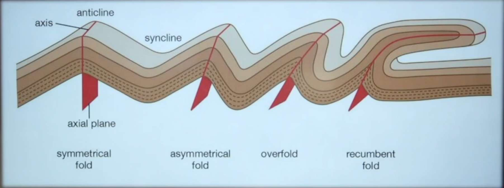

**Earth’s Internal Structure: Concentric Layers**

- Earth is composed of several concentric layers, meaning layers arranged like circles sharing the same center. These layers are nested within each other, forming the Earth’s internal structure.

**Crust: Composition, Structure, and Thickness**

- The crust is the thinnest layer, similar to the thin outer green layer of a watermelon.
- Thickness varies:
  - Continental crust: up to ~35 km thick.
  - Oceanic crust: about 5 km thick.
- Continental crust is thicker because it forms landmasses above sea level, while oceanic crust lies beneath oceans.
- The crust consists mainly of minerals rich in **Silicon (Si)** and **Aluminum (Al)** (SiAl).
- **Oxygen** is the most abundant non-metal in the crust, present due to its role in forming various minerals and the presence of cracks allowing oxygen movement.
- Oceanic crust mainly consists of **silicon** and **Magnesium (Mg)** (SiMa).

| Crust Type        | Thickness (km) | Major Elements             |
| ----------------- | -------------- | -------------------------- |
| Continental Crust | ~35            | Silicon, Aluminum, Oxygen  |
| Oceanic Crust     | ~5             | Silicon, Magnesium, Oxygen |

- **Density and Mineral Composition of Crust**
- Continental crust is higher in elevation compared to oceanic crust due to its composition and thickness.
- Earth's crust minerals:
  - Mostly silicon and aluminum (continental crust).
  - Oceanic crust mainly silicon and magnesium.
- Oxygen is the most abundant non-metal; metals like silicon and aluminum are abundant.

**Mantle: Location and Characteristics**

- Lies beneath the crust, extending to about 2900 km depth.
- Mantle divided into two parts:
  - Upper mantle (extends approx. 90 km) including the **Asthenosphere** (weak layer extending to about 400 km depth).
  - Lower mantle (deeper parts below upper mantle).
- The asthenosphere is a semi-fluid, weaker zone allowing tectonic plates to move.
- Lithosphere is uppermost part of mantle + crust (100km-200km).

**Core: Innermost Layer**

- The core is the deepest and most dense layer of Earth, approximately 3500 km thick.
- Composed mainly of **Nickel (Ni)** and **Iron (Fe)**.
- These metals are magnetic, and their rotation along with Earth's 24-hour spin generates Earth’s magnetic field.
- The magnetic field protects Earth from harmful solar ra diation and influences phenomena such as auroras.
- Core experiences extremely high temperature and pressure due to the weight of overlying layers (crust and mantle).

**Density and Layer Classification by Density**

- Density increases from crust to core:
  - Upper crust density (Si and Al) ~2.7 g/cm³.
  - Lower crust slightly higher.
  - Mantle (Si and Ma) ~5 g/cm³.
  - Outer core higher density.
  - Inner core (Ni and Fe) up to 15 g/cm³.
- Example analogy: wood has less density than iron; similarly, the Earth's core is much denser than the crust.

| Earth Layer | Approximate Density (g/cm³) |
| ----------- | --------------------------- |
| Upper Crust | 2.7                         |
| Lower Crust | ~3.0 _Not specified_        |
| Mantle      | 5.0                         |
| Outer Core  | _Not specified_             |
| Inner Core  | 15.0                        |

**Chemical Composition and Layer Division (Edvard’s Classification)**

- Earth divided into three major layers based on chemical composition by Edvard:
  - **Crust:** Silicon and Aluminum.
  - **Mantle:** Silicon and Magnesium.
  - **Core:** Nickel and Iron.
- These are the major layers studied in Earth’s internal structure.

**Discontinuities Within Earth’s Interior**

- Discontinuities are boundaries where properties abruptly change. Key discontinuities include:

| Discontinuity Name       | Location Between Layers       |
| ------------------------ | ----------------------------- |
| Conrad Discontinuity     | Outer Crust and inner Crust   |
| Mohorovičić (Moho)       | inner Crust and outer Mantle  |
| Repetti Discontinuity    | Outer Mantle and inner Mantle |
| Gutensberg Discontinuity | lower Mantle and outer Core   |
| Lehmann Discontinuity    | Outer Core and inner Core     |

- These discontinuities are essential for understanding seismic wave behavior and Earth’s internal layering.

**Continents: Number and Historical Evolution (Alfred Wegener’s Theory)**

- Earth has seven continents presently.
- Alfred Wegener proposed that initially, Earth had a single supercontinent called **Pangaea** and ocean called **Panthalassa** about **250 million years ago**.
- Pangaea later split into two large landmasses:
  - **Laurasia** (Northern part).
  - **Gondwana** (Southern part).
- Between these landmasses was a vast ocean named **Tethys sea**.
- Over time, these landmasses further fragmented to form present continents.

**Geological Timeframes and Continental Drift**

- The breakup of Pangaea occurred during the Permian period (~250 million years ago) and continued into Jurassic and Cretaceous periods.
- India’s Deccan volcanic activity occurred around 65 million years ago.
- Present continents are remnants of these historical landmasses.

**Evidence Supporting Continental Drift (Wegener’s Five Points)**

| Evidence               | Description                                                                             |
| ---------------------- | --------------------------------------------------------------------------------------- |
| Fit of Continents      | Coastlines of continents like South America and Africa fit together like puzzle pieces. |
| Similar Fossils        | Identical fossils found on widely separated continents (e.g., Mesosaurus).              |
| Similar Rock Ages      | Matching rock types and ages along continental borders.(By Radiomatic dating)           |
| Glacial Deposits       | Similar glacial deposits found on continents now far apart.                             |
| Paleoclimatic Evidence | Coal deposits in Antarctica indicate past tropical climates.                            |

**Wegener’s Proposed Mechanisms and Their Limitations**

- Proposed that gravitational forces of the Sun and Moon caused continental drift, but this was later rejected due to insufficient force and contradictions with Earth’s rotation.
- Suggested centrifugal force from Earth's rotation caused continents to split and drift polewards, but this was contradicted by the presence of land at the equator.
- These limitations led to the development of newer theories.

**Convection Currents and Sea Floor Spreading**

- Convection currents in Earth’s mantle cause movement of plates.
- Sea floor spreading occurs at mid-ocean ridges, where magma rises, cools, and forms new oceanic crust.
- Older crust moves away from the ridges, creating a pattern of age and movement.
- Significant mid-ocean ridges include:
  - Mid-Atlantic Ridge.
  - Central Indian Ocean Ridge.
  - Pacific Ocean boundaries.

**Plate Tectonics Theory**

- Proposed by McKenzie, Parker, and Morgan, explaining Earth’s lithosphere as divided into rigid plates floating on the asthenosphere.
- Plates fit together like a jigsaw puzzle and include both continental and oceanic types.
- Plates move relative to each other, causing geological phenomena.

**Types of Plates and Their Classification**

| Plate Type   | Description                                                   | Examples                                                                               |
| ------------ | ------------------------------------------------------------- | -------------------------------------------------------------------------------------- |
| Major Plates | Large plates covering significant portions of Earth’s surface | North American, South American, Eurasian, African, Indo-Australian, Pacific, Antarctic |
| Minor Plates | Smaller plates with less surface area                         | Nazca, Juan de Fuca, Scotia, Philippine, Arabian                                       |

- Total of 7 major plates and 20 minor plates identified.

**Plate Movements and Boundaries**

- Three primary types of plate movements:

  - **Divergent:** Plates move apart.
  - **Convergent:** Plates move towards each other.
  - **Transform:** Plates slide past one another.

- Plate boundaries classified accordingly:
  - Divergent boundaries create new crust (e.g., mid-ocean ridges).
  - Convergent boundaries cause collisions, forming fold mountains, trenches, and volcanic activity.
  - Transform boundaries cause earthquakes due to sliding plates.

**Types of Plate Collisions (Convergent Boundaries)**

| Collision Type          | Resulting Features                         | Examples                    |
| ----------------------- | ------------------------------------------ | --------------------------- |
| Continental-Continental | Fold mountains                             | Himalayas                   |
| Oceanic-Continental     | Subduction, volcanic mountains, trenches   | Andes Mountains             |
| Oceanic-Oceanic         | Subduction, trenches, volcanic island arcs | Mariana Trench, Island arcs |

- Subduction zones involve denser oceanic plates sinking beneath lighter continental plates.
- In oceanic-oceanic collision- Benioff zone melts in mantle and volcano forms.
  

**Divergent Boundaries and Landforms**

- Divergent boundaries create new crust by magma rising and solidifying.
- Two types of divergent boundaries:
  - Continental-Continental divergence: forms rift valleys and block mountains.
  - Oceanic-Oceanic divergence: forms mid-ocean ridges (sea floor spreading).
- Example: Mid-Atlantic Ridge formed by oceanic-oceanic divergence.

**Transform Boundaries**

- Plates slide past each other horizontally without creating or destroying crust.
- Commonly associated with earthquakes and fault lines.
- Example: San Andreas Fault in California.
